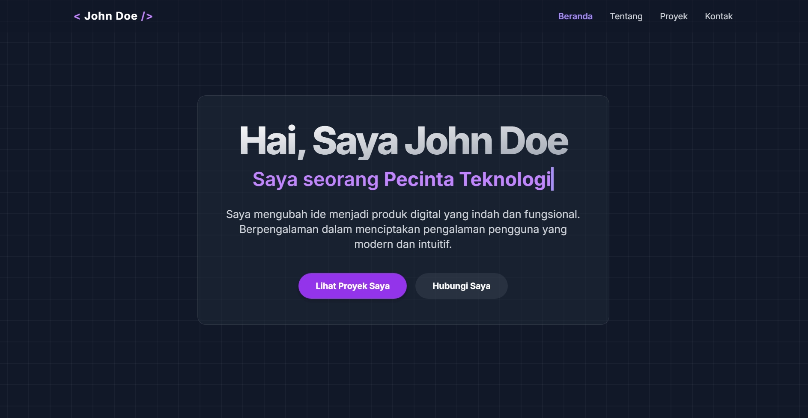

# 🌐 PortofolioSite

## Portofolio Web Modern & Interaktif

<div align="center">
  
</div>

<br>

Selamat datang di repositori **Portofolio Web Modern** saya! Proyek ini adalah halaman portofolio single-page yang dirancang untuk menampilkan proyek dan keahlian secara bersih, modern, dan interaktif — dengan fokus pada estetika dan pengalaman pengguna yang optimal.

## 📜 Tentang Proyek

Portofolio ini tidak hanya berfungsi sebagai CV online, tetapi juga sebagai bukti kemampuan dalam pengembangan web front-end. Desainnya mengadopsi tren modern seperti **glassmorphism**, **efek glow**, dan dilengkapi dengan halaman **404 kustom** untuk menghadirkan pengalaman pengguna yang menyenangkan bahkan saat halaman tidak ditemukan.

## ✨ Fitur Utama

- 💻 **Desain Modern & Responsif** — Tampilan optimal di semua perangkat  
- 🌀 **Latar Belakang Dinamis** — Grid halus bergaya teknologi  
- 🧊 **Efek Glassmorphism** — Elemen kaca buram pada banner & kontak  
- ⌨️ **Typing Effect** — Judul pekerjaan yang berubah dinamis  
- 🃏 **Kartu Proyek Interaktif** — Efek glow saat hover  
- 🧭 **Navigasi Intuitif** — Scroll mulus & penanda aktif  
- 🤖 **Halaman 404 Kustom** — Karakter robot tersesat yang interaktif dan lucu  
- 📁 **Struktur Kode Terorganisir** — Terpisah antara HTML, CSS, dan JS

## 🤖 Halaman 404: Robot Tersesat

Untuk menangani error *Halaman Tidak Ditemukan*, proyek ini menyertakan halaman `404.html` kustom yang dirancang agar user tetap merasakan pengalaman menarik meskipun masuk ke URL yang salah.

### Fitur Halaman 404:

- **Tema Luar Angkasa** — Latar belakang gelap + angka “404” transparan  
- **Robot Kustom** — Dibuat 100% dengan HTML dan CSS (tanpa gambar)  
- **Animasi:**  
  - Efek melayang naik-turun  
  - Mata berkedip  
  - Lengan berayun  
  - Bayangan berdenyut  
- **Tombol Aksi:** "Bawa Saya Pulang" yang mengarah ke beranda (`index.html`)

---

## 🚀 Teknologi yang Digunakan

- **HTML5** — Struktur semantik halaman  
- **CSS3** — Styling, animasi, dan karakter robot  
- **Tailwind CSS** — Utility-first CSS framework  
- **JavaScript (ES6+)** — Efek interaktif dan DOM manipulation  
- **Lucide Icons** — Ikon SVG ringan & modern

---

## 📂 Struktur Berkas

```
/
├── index.html     # Struktur utama halaman  
├── style.css      # Styling dan efek visual  
├── script.js      # Interaktivitas halaman  
└── 404.html       # Halaman error 404 kustom
```

---

## 🛠️ Cara Menggunakan

### ✅ Jalankan Secara Lokal

1. **Clone repositori ini**:

   ```bash
   git clone https://github.com/Eko079/PortofolioSite2.git
   ```

2. **Masuk ke direktori proyek**:

   ```bash
   cd PortofolioSite2
   ```

3. **Buka `index.html` di browser**:  
   Cukup klik dua kali atau gunakan:

   ```bash
   start index.html
   ```

---

## 🌐 Deploy ke GitHub Pages

1. Push semua file (`index.html`, `style.css`, `script.js`, `404.html`) ke repository GitHub.

2. Buka **Settings > Pages** di GitHub repository Anda.

3. Pilih source: `main branch /root`.

4. Pastikan `404.html` berada di root folder (bukan di dalam subfolder). GitHub Pages akan otomatis menggunakan file ini saat halaman tidak ditemukan.

---

## 🧾 Deploy ke Web Server Sendiri

### Menggunakan **Nginx**:

1. Upload semua file ke direktori web, misalnya `/var/www/html/`.

2. Edit konfigurasi Nginx (misalnya `/etc/nginx/sites-available/default`), lalu tambahkan:

   ```nginx
   server {
       listen 80;
       server_name yourdomain.com;

       root /var/www/html;
       index index.html;

       location / {
           try_files $uri $uri/ =404;
       }

       error_page 404 /404.html;
       location = /404.html {
           internal;
       }
   }
   ```

3. Restart Nginx:

   ```bash
   sudo systemctl restart nginx
   ```

### Menggunakan **Apache**:

1. Upload semua file ke direktori web, misalnya `/var/www/html/`.

2. Tambahkan atau edit file `.htaccess`:

   ```apache
   ErrorDocument 404 /404.html
   ```

3. Restart Apache:

   ```bash
   sudo systemctl restart apache2
   ```

---

## 🎨 Kustomisasi

- **Profil & Deskripsi:** Edit `index.html` untuk menyesuaikan dengan data Anda  
- **Gambar:** Ganti `screenshot.png`, gambar profil, atau gambar proyek  
- **Efek Mengetik:** Ubah array `words` di `script.js`  
- **Skema Warna:** Edit langsung di `style.css` atau ubah kelas Tailwind di `index.html`  
- **Halaman 404:** Edit teks, warna, dan animasi di `404.html`

---

## ⚠️ Disclaimer

Proyek ini dibuat dengan bantuan teknologi **AI (Artificial Intelligence)** sebagai alat bantu dalam menulis kode, mendesain antarmuka, dan menyusun dokumentasi.  
Meskipun telah diupayakan semaksimal mungkin untuk memberikan hasil yang akurat dan profesional, **mungkin masih terdapat kesalahan atau kekurangan**, baik secara teknis maupun konten.

Gunakan dengan bijak, lakukan review sebelum produksi, dan modifikasi sesuai kebutuhan Anda.

---

<div align="center">
⭐ Terima kasih telah mengunjungi!  
Jika proyek ini bermanfaat, silakan beri ⭐ di repositori ini!
</div>
